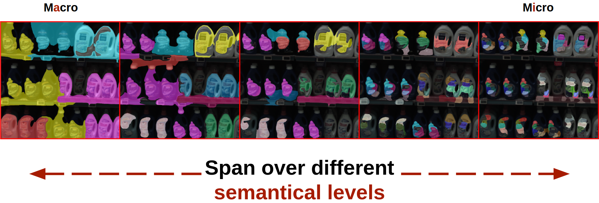

# patterns-detection-icpr2020

Release code of paper _"Unsupervised semantic discovery through visual patterns detection - Pelosin F., Gasparetto A., Albarelli A., Torsello A."_ submitted to ICPR 2020.




# How to Run 

## Jupyter Notebook

1. Clone the repo:

`git clone https://github.com/francesco-p/patterns-detection-icpr2020`

2. Download the dataset at [this](https://drive.google.com/drive/folders/1vLC8hkjq-eNWtAh_nf0KdFItn4oA-KIy?usp=sharing) link. Extract the data and move the `datasets` folder inside the cloned repo. 

The folder structure you should at this point is:

```
.
├── datasets
│   ├── img01.png
│   ├── semantic_lvl1
│   ├── semantic_lvl2
│   └── ...
├── fig1.png
├── notebooks
│   ├── 01-run.ipynb      <-- Interactive run of the method on an image
│   └── 02-dataset.ipynb  <-- Dataset Visualization
├── output                <-- Output of scripts/run.py
│   └── img01.png
├── README.md
├── scripts
│   └── run.py            <-- Run the method to an image
└── src
    ├── accumulator.py
    ├── detector.py
    ├── detector.pyc
    ├── extractor.py
    ├── metrics.py
    └── utils.py
```
If it is so, good.  

3. Make sure you have [docker](https://www.docker.com/) installed, then run:

`sudo docker run --rm -it -p 8889:8889 -v /path/to/patterns-detection-icpr2020:/descriptor fpelosin/patterns-detection-icpr:v2 bash`

Replace `/path/to/...` with the absolute path of the cloned repo. If you reached this point you are inside the container and you have all the tools to run the method.

> Since we are using `opencv` with `xfeatures2d` module for the extraction of DAISY descriptors, we had troubles using `virtualenv` or `conda`...we then opted for `docker`.


4. I suggest to start with the notebook `notebooks/01_run.ipynb`, therefore run: 

`jupyter-lab --allow-root --port=8889 --ip=0.0.0.0 --no-browser`

Now you have access the jupyter lab environment, and you can start play around.

> **Note:** if port `8889` is already taken, substitute it with another one.

## Python script

If you want to run the method in the console, please simply follow the *Jupyter Notebook* instructions up to step 3. After that just run the script `run.py` in the folder `scripts/`. All the parameters (input image, output image, algorithm params) can be specified by hacking directily the params section of the file.


# Dataset

In the `datasets` folder you find the released dataset. The labeling has been made through the [labelme](https://github.com/wkentaro/labelme) annotation tool. The format of the annotation is the Pascal VOC format. 

I included a notebook in `notebooks/02-dataset.ipynb` that provides a brief visualization of the dataset.


